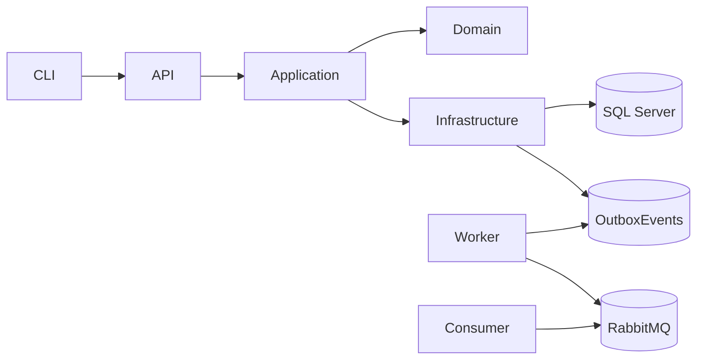

# PagueVeloz – Transaction Processor (C# .NET 9)

Implementação do **núcleo transacional** do desafio “Sistema de Processamento de Transações Financeiras”, com foco em:

- **Consistência forte por conta** (operações atômicas e serializadas por lock)
- **Concorrência segura** (evita “double spend”, com ordenação de locks para multi-contas)
- **Idempotência** por `reference_id` (repetição devolve o mesmo resultado)
- **Auditabilidade** (registro imutável de eventos por conta / ledger + trilha de transações)
- **Resiliência** (Outbox + retry com backoff exponencial + jitter + circuit breaker)
- **Observabilidade** (logs estruturados + tracing/métricas OpenTelemetry + health checks)

> Convenção: valores monetários são `long` em **centavos**.

---

## 1) Como iniciar (Quickstart)

### Requisitos
- **.NET 9 SDK**
- **Docker + Docker Compose** (recomendado)
- (Opcional) **SQL Server local** se não usar Docker

### Subir tudo via Docker (recomendado)

Na raiz do repositório:

```bash
docker compose up --build
```

Serviços expostos:
- API: `http://localhost:5000`
- Swagger: `http://localhost:5000/swagger`
- RabbitMQ UI: `http://localhost:15672` (guest/guest)
- Kibana: `http://localhost:5601`
- Elasticsearch: `http://localhost:9200`
- APM Server (OTLP): `http://localhost:8200`

Health checks:
- `GET /health/live`
- `GET /health/ready`

### Rodar local sem Docker (somente API)
1. Configure `ConnectionStrings__SqlServer` (e, se quiser eventos, RabbitMQ).
2. Rode:
```bash
dotnet build
dotnet run --project src/PagueVeloz.TransactionProcessor.Api
```

> Observação: a API chama `EnsureCreated()` no startup para simplificar o desafio. Em produção, use **migrations**.

---

## 2) Mapeamento direto dos requisitos do desafio

| Requisito do enunciado | Como foi atendido |
|---|---|
| C# .NET 9 + async/await | Projetos em .NET 9, handlers/infra assíncronos |
| API REST e/ou CLI | API Minimal + Swagger + projeto CLI opcional |
| Regras de negócio (credit, debit, reserve, capture, reversal, transfer) | Implementadas no **Domain** e orquestradas no **Application** |
| “Saldo disponível não pode ficar negativo” | Regra modelada como `AvailableBalance = Balance - ReservedBalance`; `reserve` valida `AvailableBalance` |
| “Débito considera saldo disponível + limite de crédito” | `Debit()` permite saldo negativo até `CreditLimit` |
| Concorrência por conta (bloquear operações concorrentes na mesma conta) | `SELECT ... WITH (UPDLOCK, ROWLOCK)` + transação SQL |
| Atomicidade | Cada operação ocorre dentro de **uma transação SQL**; `transfer/reversal` multi-contas é atômico |
| Eventos assíncronos | **Outbox** grava evento na mesma transação; **Worker** publica no RabbitMQ |
| Retry com backoff exponencial | Outbox Publisher com backoff exponencial + jitter; deadlock/concurrency retry no caso de uso |
| Idempotência por `reference_id` | Índice **UNIQUE** + “read-your-writes” retornando o persistido |
| Rollback em falhas | Transação SQL garante rollback; falhas de regra de negócio persistem `failed` (auditável) |
| Logs/métricas/tracing/health | Serilog JSON + OpenTelemetry + health endpoints |
| Docker (diferencial) | `docker-compose.yml` sobe stack completa (SQL/RabbitMQ/EFK/APM) |
| Testes unitários e integração | xUnit + Testcontainers (SQL Server), cenários + concorrência + idempotência |

---

## 3) Arquitetura

### 3.1 Estrutura de projetos

- `src/PagueVeloz.TransactionProcessor.Api`  
  **REST** + Swagger + serialização `snake_case` + health checks + OpenTelemetry.
- `src/PagueVeloz.TransactionProcessor.Application`  
  Casos de uso com **MediatR**, validação com **FluentValidation**, contratos (DTOs).
- `src/PagueVeloz.TransactionProcessor.Domain`  
  Regras/invariantes do domínio: saldo, reserva/captura, limite de crédito, status.
- `src/PagueVeloz.TransactionProcessor.Infrastructure`  
  Persistência (EF Core + SQL Server), repositórios, Outbox, fila interna, publisher RabbitMQ.
- `src/PagueVeloz.TransactionProcessor.Worker`  
  Processa Outbox (publica eventos) + processa fila interna de comandos assíncronos.
- `src/PagueVeloz.TransactionProcessor.Cli`  
  Cliente de linha de comando para enviar lotes de transações.
- `src/PagueVeloz.TransactionProcessor.EventConsumer`  
  Consumidor de exemplo para auditar eventos publicados no RabbitMQ (usado no compose).

### 3.2 Por que Clean Architecture / DDD-ish?

- **Separação de responsabilidades**: domínio não depende de framework.
- **Extensibilidade**: facilita futura divisão em microsserviços (ex.: “Account Service”, “Transaction Service”).
- **Testabilidade**: regras em `Domain` testadas sem banco/infra.

Diagrama (alto nível):



---

## 4) Modelo de Domínio e regras

### 4.1 Agregado `Account`

Campos principais:
- `Balance` (saldo total)
- `ReservedBalance` (saldo reservado)
- `AvailableBalance = Balance - ReservedBalance`
- `CreditLimit` (limite de crédito)
- `Status` (`Active`, `Inactive`, `Blocked`)
- `LedgerSequence` (sequência monotônica para ledger por conta)

### 4.2 Semântica das operações

| Operação | Efeito no estado |
|---|---|
| `credit` | `Balance += amount` |
| `debit` | `Balance -= amount` (pode ficar negativo até `CreditLimit`) |
| `reserve` | `ReservedBalance += amount` (exige `AvailableBalance >= amount`) |
| `capture` | `ReservedBalance -= amount` e `Balance -= amount` |
| `transfer` | `Debit` na origem + `Credit` no destino (na **mesma transação SQL**) |
| `reversal` | Reverte a transação anterior (ver seção 6) |

> Observação: `capture` aceita opcionalmente `related_reference_id` para rastreio/auditoria do “reserva → captura”, mas a consistência é garantida pelo saldo reservado, não por “amarração” a um id de reserva (mantém o escopo simples e eficiente para o desafio).

---

## 5) Persistência e modelagem relacional

Banco: **SQL Server** via **EF Core 9**.

### Tabelas principais
- `Accounts`  
  Saldo, reservado, limite, status, `LedgerSequence`, `RowVersion`.
- `Transactions`  
  Registro idempotente por `ReferenceId` (**UNIQUE**).
- `AccountEvents`  
  Ledger imutável por conta (chave única `(AccountId, Sequence)`).
- `OutboxEvents`  
  Eventos pendentes de publicação (tentativas, próximo retry, erro).
- `QueuedCommands`  
  Fila interna para processar `/transactions/enqueue`.

### Índices relevantes
- `Transactions.ReferenceId` **UNIQUE** (idempotência forte)
- `AccountEvents (AccountId, Sequence)` **UNIQUE** (ledger consistente)
- `OutboxEvents (ProcessedAt, NextAttemptAt)` (varredura eficiente)
- `QueuedCommands (Status, EnqueuedAt)` (dequeue eficiente)

---

## 6) Concorrência, atomicidade e idempotência

### 6.1 Por que locking pessimista aqui?

Em “ledger de pagamentos”, o problema clássico é **double spend** em alta concorrência.  
A escolha foi **pessimistic locking** no SQL Server:

- `SELECT ... WITH (UPDLOCK, ROWLOCK)` para **bloquear concorrentes** na mesma conta.
- **Transação SQL** ao redor de toda operação, com **IsolationLevel.Serializable** no processamento síncrono (simplifica raciocínio e evita anomalias).
- Para operações com **duas contas** (`transfer`, `reversal` de transfer), aplica-se **ordenação de locks** (ordem lexicográfica do `account_id`) para reduzir risco de deadlocks.

### 6.2 Retry de concorrência / deadlock

O caso de uso faz retry em:
- `DbUpdateConcurrencyException`
- Deadlock SQL Server (erro 1205)

Com limite de tentativas (`maxAttempts`), limpando o ChangeTracker e esperando entre tentativas.

### 6.3 Idempotência

Estratégia “dupla” (lógica + banco):

1. Antes de processar, consulta `Transactions` por `reference_id`.
2. Persistência garante unicidade: índice **UNIQUE** em `Transactions.ReferenceId`.

Repetiu o mesmo comando?  
✅ retorna o resultado persistido, sem re-aplicar regras de negócio.

---

## 7) Eventos, Outbox e processamento assíncrono

### 7.1 Outbox Pattern (por quê)

Publicar em broker *dentro* da mesma transação do banco exigiria “distributed transaction” (2PC) ou riscos de inconsistência (commita banco mas falha publish).  
O **Outbox** resolve isso:

- O caso de uso grava `OutboxEvents` **na mesma transação** que atualiza conta/transação.
- O **Worker** varre outbox e publica em RabbitMQ.
- Publicação é **at-least-once** (consumidores devem ser idempotentes).

### 7.2 Retry com backoff exponencial + jitter

No Worker:
- calcula `NextAttemptAt` com backoff exponencial (cap em 60s) + jitter.
- registra `Attempts` e `LastError`.

### 7.3 Circuit breaker (diferencial)

Se o broker estiver instável:
- abre circuito após N exceções
- pausa por ~30s
- evita tempestade de retries e protege o banco.

### 7.4 Fila interna de comandos (simulação de alto volume)

Endpoint `POST /api/transactions/enqueue` grava um comando em `QueuedCommands`.  
O Worker:
- faz `TryDequeue` com `UPDLOCK + READPAST` (safe dequeue)
- executa o mesmo `ProcessTransaction`
- marca como `Done` ou `Failed`.

---

## 8) API REST

### 8.1 Padrões
- JSON `snake_case`
- Valores monetários em **centavos** (`long`)
- `reference_id` obrigatório (idempotência)

### 8.2 Endpoints

**Accounts**
- `POST /api/accounts` – cria conta
- `GET /api/accounts/{accountId}` – consulta conta
- `GET /api/accounts/{accountId}/transactions` – histórico da conta

**Transactions**
- `POST /api/transactions` – processa síncrono
- `POST /api/transactions/enqueue` – enfileira assíncrono (retorna `202 Accepted`)
- `GET /api/transactions/{referenceId}` – consulta resultado persistido

### 8.3 Exemplo (criar conta)

```bash
curl -X POST http://localhost:5000/api/accounts \
  -H "Content-Type: application/json" \
  -d @samples/create_account.json
```

### 8.4 Exemplo (crédito)

```bash
curl -X POST http://localhost:5000/api/transactions \
  -H "Content-Type: application/json" \
  -d '{
    "operation": "credit",
    "account_id": "ACC-001",
    "amount": 10000,
    "currency": "BRL",
    "reference_id": "TXN-001",
    "metadata": { "description": "Depósito inicial" }
  }'
```

**Resposta típica (success):**
```json
{
  "transaction_id": "TXN-001-PROCESSED",
  "status": "success",
  "balance": 10000,
  "reserved_balance": 0,
  "available_balance": 10000,
  "timestamp": "2026-01-31T18:00:00.0000000Z",
  "error_message": null
}
```

**Resposta típica (failed):**
```json
{
  "transaction_id": "TXN-003-PROCESSED",
  "status": "failed",
  "balance": 80000,
  "reserved_balance": 0,
  "available_balance": 80000,
  "timestamp": "2026-01-31T18:00:00.0000000Z",
  "error_message": "Insufficient funds considering credit limit."
}
```

> HTTP status: a API devolve `200` para sucesso e `400/404` quando `status=failed` (conforme tipo de erro).

### 8.5 OpenAPI/Swagger
Swagger disponível em: `http://localhost:5000/swagger`

---

## 9) CLI (opcional)

Enviar um arquivo JSON (lista de transações):

```bash
dotnet run --project src/PagueVeloz.TransactionProcessor.Cli -- --url http://localhost:5000 --file samples/transactions_sync.json
```

Para enfileirar em background:

```bash
dotnet run --project src/PagueVeloz.TransactionProcessor.Cli -- --url http://localhost:5000 --file samples/transactions_sync.json --async
```

---

## 10) Observabilidade

### Logs estruturados
- Serilog JSON (`RenderedCompactJsonFormatter`)
- Com Docker: logs em `/var/log/pv/*.log` e Filebeat envia para Elasticsearch
- Kibana: `http://localhost:5601`

KQL úteis:
- `reference_id : "TXN-001"`
- `account_id : "ACC-001"`
- `operation : "debit"`

### Traces e métricas
- OpenTelemetry (AspNetCore + HttpClient + Runtime + Process)
- Export OTLP para `apm-server` no compose
- Kibana → Observability → APM / Metrics

---

## 11) Testes

Rodar todos:
```bash
dotnet test
```

- **UnitTests**: valida invariantes do domínio (ex.: debit/reserve/capture).
- **IntegrationTests**: usa **Testcontainers** para subir SQL Server e testa:
  - idempotência
  - concorrência (debits/credits/transfers simultâneos)
  - cenários do enunciado
  - fila assíncrona + outbox

---

## 12) Troubleshooting

Ver status:
```bash
docker compose ps
```

Ver logs:
```bash
docker compose logs -f api
docker compose logs -f worker
docker compose logs -f sqlserver
docker compose logs -f rabbitmq
docker compose logs -f elasticsearch
docker compose logs -f filebeat
```

Reset total (remove volumes):
```bash
docker compose down -v
docker compose up --build
```

Elasticsearch não inicia (Linux):
```bash
sudo sysctl -w vm.max_map_count=262144
```

---

## 13) Decisões e trade-offs (resumo)

- **Locking pessimista** (UPDLOCK) em vez de otimista: reduz risco de “lost update” e simplifica consistência em alto volume.
- **Outbox** em vez de “publish in-tx”: evita necessidade de 2PC e mantém consistência entre banco e eventos.
- **Fila interna em tabela** para async: simples, reproduzível e suficiente para o desafio; em produção poderia virar broker/stream.
- **EnsureCreated** para simplificar: em produção, usar migrations + pipeline de deploy.

---

## 14) Próximos passos (se fosse produção)

- Autenticação/Autorização (JWT/OAuth2), multi-tenant (client_id no contexto)
- Rate limiting + proteção contra abuse
- Versionamento de eventos + schema registry
- DLQ + políticas de reprocessamento
- Migrations + observabilidade “golden signals” (latência, erro, saturação, tráfego)
- Particionamento/sharding por `account_id` e leitura por réplica
- Sagas para fluxos distribuídos mais complexos

---

## Docs adicionais
Veja `docs/` para detalhes:
- `docs/architecture.md`
- `docs/operations.md`
- `docs/concurrency.md`
- `docs/resilience.md`
- `docs/testing.md`
- `docs/runbook.md`
- `docs/adr/*` (Architecture Decision Records)
