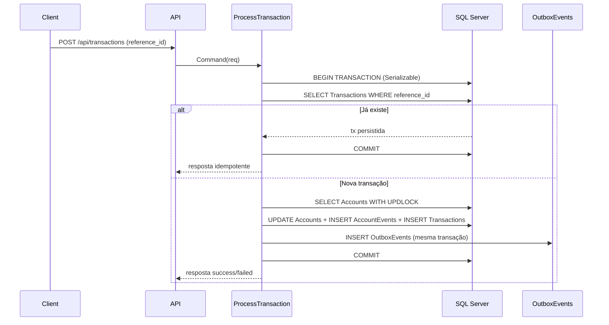
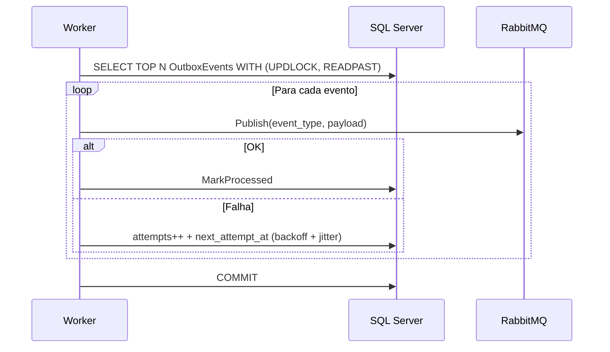

# Arquitetura – Deep dive

Este documento detalha **o porquê** das principais escolhas arquiteturais e como o sistema se comporta sob carga/concor­rência.

## Objetivos não-funcionais (NFRs)

1. **Correção sob concorrência**  
   Nenhuma operação pode produzir “double spend”, “lost update” ou inconsistência entre saldo, reservado e disponível.
2. **Auditabilidade e rastreabilidade**  
   Toda mudança relevante tem trilha persistida (`Transactions` + `AccountEvents`) e correlação (`reference_id`).
3. **Resiliência na integração**  
   Falha em publicar eventos não pode quebrar o processamento transacional.
4. **Operacional**  
   Logs estruturados, tracing, métricas e health checks.

---

## Componentes e responsabilidades

### API
- Exposição HTTP (`/api/accounts`, `/api/transactions`)
- Tratamento de erros e mapeamento para HTTP status
- Swagger/OpenAPI
- Telemetria (OpenTelemetry)

### Application
- Orquestração do caso de uso (`ProcessTransaction`)
- Validação de entrada (FluentValidation)
- Criação de eventos de integração (payload JSON)
- Persistência do resultado de forma idempotente

### Domain
- Agregado `Account` e invariantes
- Operações com semântica clara e verificações defensivas
- Exceções de domínio (`DomainException`) para erros de regra

### Infrastructure
- EF Core + SQL Server
- Locks por conta via queries com hints (`UPDLOCK`)
- Stores/Repositórios: `Accounts`, `Transactions`, `AccountEvents`, `OutboxEvents`, `QueuedCommands`
- Publisher RabbitMQ

### Worker
- Publicação do Outbox (at-least-once)
- Processamento da fila interna de comandos (async)
- Retry/backoff/jitter e circuit breaker

---

## Fluxos principais

### Fluxo síncrono (POST /api/transactions)

### Fluxo de eventos (Outbox → RabbitMQ)

---

## Por que “ledger” + “transactions”?

- `Transactions` é o **resultado idempotente** “para fora” (API/consumidores consultarem).
- `AccountEvents` é o **ledger sequencial** por conta: permite auditoria e reconstrução de estado (parcial), além de ajudar em investigações.

Em produção, o ledger poderia evoluir para **Event Sourcing** completo. Aqui, a solução mantém o escopo simples, mas já “abre caminho” para evolução.

---

## Considerações de escalabilidade

- “Hot accounts”: uma conta muito movimentada vira gargalo (lock).  
  Mitigações típicas: particionamento por conta, sharding, limites de throughput por tenant, e/ou re-arquitetar para stream/append-only com reconciliação.
- Worker horizontal: outbox e command queue usam `READPAST`, permitindo múltiplos workers sem “pegar o mesmo item”.

---

## Decisões importantes

- **Lock ordering** em operações multi-contas  
  Impede inversão de locks (A→B vs B→A) que gera deadlock.
- **Circuit breaker** no publish  
  Protege o sistema (banco/CPU) quando o broker está indisponível.
- **Backoff exponencial com jitter**  
  Evita thundering herd durante instabilidade.
